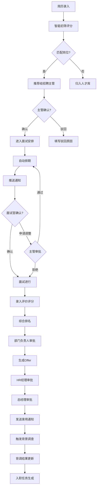
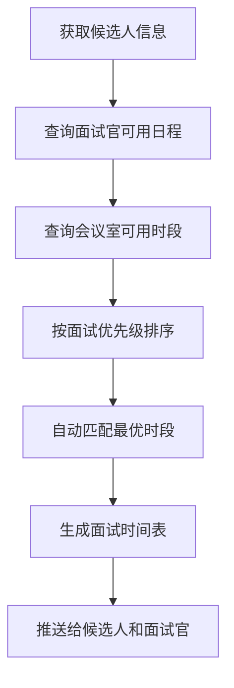

## 1. 产品概述
大型企业人才招聘与智能筛选桌面系统，旨在通过智能化简历筛选、自动化面试排期、规范化录用审批和一体化入职管理，大幅提升企业招聘效率与候选人体验。目标用户为HR招聘团队、部门招聘主管、面试官和高层管理者。

## 2. 核心功能

### 2.1 用户角色
| 角色 | 进入方式 | 核心权限 |
|------|----------|----------|
| HR招聘专员 | 系统账号登录 | 简历录入/导入、岗位发布、初筛评分配置、面试协调、Offer生成、背调管理、统计分析 |
| 部门招聘主管 | 系统账号登录 | 确认/驳回初筛简历、审批面试调整、查看部门候选人排名 |
| 面试官 | 系统账号登录 | 确认/调整面试安排、录入面试评价和评分、更新面试状态 |
| HR经理 | 系统账号登录 | 审批Offer、查看全量招聘数据 |
| 总经理 | 系统账号登录 | 终审Offer、查看关键招聘指标 |
| 部门负责人 | 系统账号登录 | 审批综合排名推荐、确认录用意向 |

### 2.2 功能模块
1. **工作台首页**：招聘概览数据卡片、待办事项列表、近期面试日程、快捷操作入口
2. **简历管理**：简历信息录入、简历列表与搜索、简历详情查看、初筛自动评分
3. **岗位与筛选**：岗位需求管理、智能筛选规则配置、筛选结果与推荐
4. **面试管理**：面试自动排期、面试官日程管理、会议室可用性、面试状态实时跟踪、面试评价录入
5. **录用审批**：Offer生成与审批流、背景调查管理、录用通知发送
6. **入职管理**：工位分配、IT设备领用、培训计划生成
7. **统计分析**：多维度数据看板、Excel月度报告导出

### 2.3 页面详情
| 页面名称 | 模块名称 | 功能描述 |
|----------|----------|----------|
| 工作台首页 | 数据概览卡片 | 显示在招岗位数、待处理简历数、本周面试数、本月Offer数 |
| 工作台首页 | 待办事项 | 显示当前用户需处理的审批、确认等待办 |
| 工作台首页 | 近期面试日程 | 展示未来3天面试安排时间线 |
| 工作台首页 | 快捷操作 | 一键录入简历、创建岗位、安排面试 |
| 简历管理 | 简历录入表单 | 录入姓名、学历、工作经验、技能标签、期望薪资 |
| 简历管理 | 简历列表 | 支持搜索、筛选、排序、分页浏览 |
| 简历管理 | 简历详情 | 完整信息展示、初筛评分、操作按钮 |
| 简历管理 | 初筛评分面板 | 展示各维度评分与综合得分、匹配岗位列表 |
| 岗位与筛选 | 岗位列表 | 展示所有在招岗位、需求人数、已招人数 |
| 岗位与筛选 | 岗位详情/编辑 | 岗位要求配置（学历、经验、技能、薪资范围） |
| 岗位与筛选 | 智能筛选结果 | 按匹配度排序的候选人列表、推荐理由 |
| 岗位与筛选 | 主管确认/驳回 | 招聘主管确认或驳回推荐（需填写驳回原因） |
| 面试管理 | 面试排期日历 | 日/周/月视图展示面试安排 |
| 面试管理 | 自动排期面板 | 根据面试官日程、会议室、优先级自动生成排期 |
| 面试管理 | 面试详情 | 候选人信息、面试官、时间、会议室、状态 |
| 面试管理 | 面试调整申请 | 面试官申请调整时间（需主管审批） |
| 面试管理 | 面试评价录入 | 评分、评语、推荐等级录入 |
| 面试管理 | 综合排名 | 自动计算排名、推送给部门负责人审批 |
| 录用审批 | Offer生成 | 填写薪资、入职日期等生成电子Offer |
| 录用审批 | 审批流程 | HR经理→总经理逐级审批、审批记录 |
| 录用审批 | 背景调查 | 分配背调任务给第三方、查看背调结果 |
| 录用审批 | 录用通知 | 审批通过后自动发送录用通知 |
| 入职管理 | 入职任务看板 | 新入职员工工位、IT设备、培训任务状态 |
| 入职管理 | 工位分配 | 自动/手动分配工位 |
| 入职管理 | IT设备领用 | 设备领用清单与状态跟踪 |
| 入职管理 | 培训计划 | 自动生成培训计划、培训进度跟踪 |
| 统计分析 | 数据看板 | 按部门/职位统计简历量、通过率、接受率、到岗率 |
| 统计分析 | 月度报告 | 生成月度招聘分析报告、导出Excel |

## 3. 核心流程

### 3.1 招聘主流程
候选人投递/HR录入简历 → 系统根据岗位需求自动初筛评分 → 推荐给招聘主管 → 主管确认/驳回 → 确认的简历进入面试安排 → 系统自动排期 → 推送通知 → 面试官确认/申请调整 → 面试实时状态更新 → 面试官录入评价评分 → 系统综合排名 → 部门负责人审批 → 生成Offer → HR经理审批 → 总经理审批 → 发送录用通知 → 触发背调 → 背调完成 → 入职任务生成

### 3.2 流程图

### 3.3 面试排期流程

## 4. 用户界面设计

### 4.1 设计风格
- 主色调：深蓝色(#1E3A5F) + 金色强调色(#D4A843)，传达专业与高端感
- 辅助色：浅灰(#F5F6FA)背景、白色卡片、绿色(#2D9B5A)成功状态、红色(#D94452)警告状态
- 按钮风格：圆角8px、主按钮深蓝实心、次按钮描边、危险操作红色
- 字体：标题使用思源黑体/Noto Sans SC Bold，正文使用Noto Sans SC Regular
- 布局风格：左侧固定导航栏 + 顶部操作栏 + 主内容区卡片式布局
- 图标风格：线性图标(lucide-react)，统一2px描边
- 整体风格：企业级专业桌面系统，数据密度适中，信息层级清晰

### 4.2 页面设计概览
| 页面名称 | 模块名称 | UI要素 |
|----------|----------|--------|
| 工作台首页 | 数据概览卡片 | 4列网格卡片、图标+数值+环比变化、微动画渐入 |
| 工作台首页 | 待办事项 | 左侧列表、优先级色标、点击跳转 |
| 工作台首页 | 日程时间线 | 右侧垂直时间线、色块区分面试状态 |
| 简历管理 | 简历录入 | 弹窗表单、分步录入、技能标签多选输入 |
| 简历管理 | 简历列表 | 表格布局、头像列、状态标签、操作按钮组 |
| 简历管理 | 初筛评分 | 雷达图展示各维度、匹配岗位标签列表 |
| 岗位与筛选 | 岗位列表 | 卡片网格布局、进度条显示招聘进度 |
| 岗位与筛选 | 筛选结果 | 左侧候选人列表+右侧详情、匹配度进度条 |
| 面试管理 | 日历视图 | 全日历视图、拖拽调整、色块区分面试类型 |
| 面试管理 | 排期面板 | 三列布局(面试官/会议室/时段)、冲突高亮 |
| 面试管理 | 评价录入 | 评分星级+文字评价、推荐等级单选 |
| 录用审批 | 审批流程 | 步骤条展示审批进度、当前节点高亮 |
| 录用审批 | Offer预览 | A4纸样预览、操作按钮组 |
| 入职管理 | 任务看板 | 三列看板(待办/进行中/已完成)、卡片拖拽 |
| 统计分析 | 数据看板 | 图表网格(柱状图/饼图/折线图)、筛选器 |
| 统计分析 | 月度报告 | 报告预览+导出按钮 |

### 4.3 响应式设计
- 桌面优先设计，最低支持1280px宽度
- 导航栏在1280px以下自动折叠为图标模式
- 表格在窄屏下横向滚动
- 弹窗/抽屉自适应屏幕尺寸

## 5. 非功能需求
- 所有数据使用前端Mock模拟，无需后端服务
- 页面加载时间 < 2秒
- 面试排期算法需考虑冲突检测
- 支持中文界面
- 统计图表需支持交互式操作（悬停、点击筛选）
