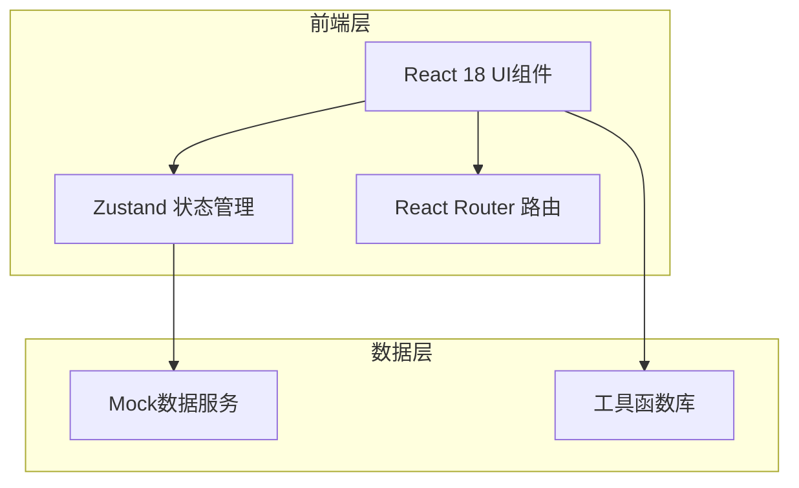
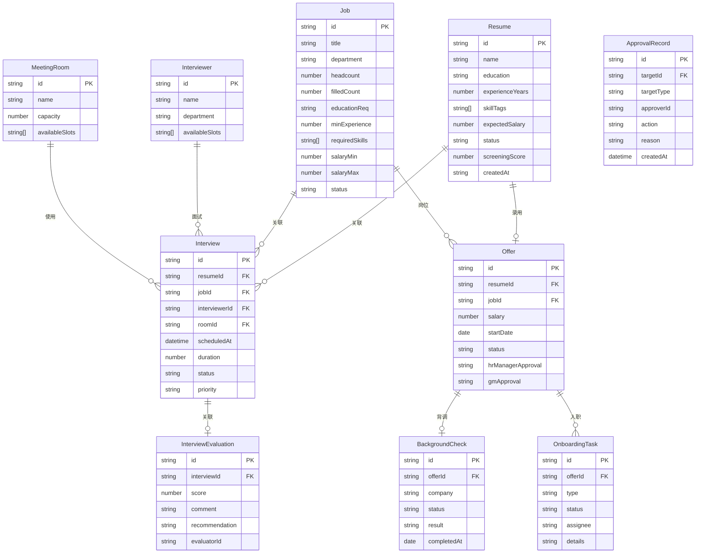

## 1. 架构设计



## 2. 技术说明
- 前端框架：React 18 + TypeScript
- 样式方案：Tailwind CSS 3
- 构建工具：Vite
- 状态管理：Zustand
- 路由：React Router DOM v6
- 图表：Recharts
- 图标：lucide-react
- Excel导出：xlsx (SheetJS)
- 日期处理：date-fns
- 初始化工具：vite-init
- 后端：无（纯前端Mock数据）
- 数据库：无（使用Zustand + localStorage持久化）

## 3. 路由定义
| 路由 | 用途 |
|------|------|
| / | 工作台首页 |
| /resumes | 简历管理-列表 |
| /resumes/new | 简历录入 |
| /resumes/:id | 简历详情 |
| /jobs | 岗位管理-列表 |
| /jobs/:id | 岗位详情 |
| /screening | 智能筛选 |
| /interviews | 面试管理-日历 |
| /interviews/:id | 面试详情 |
| /offers | 录用审批 |
| /offers/:id | Offer详情 |
| /onboarding | 入职管理 |
| /statistics | 统计分析 |

## 4. 数据模型

### 4.1 数据模型定义



### 4.2 数据定义语言

```sql
-- 简历表
CREATE TABLE resume (
  id TEXT PRIMARY KEY,
  name TEXT NOT NULL,
  education TEXT NOT NULL,
  experience_years INTEGER NOT NULL,
  skill_tags TEXT NOT NULL,
  expected_salary INTEGER NOT NULL,
  status TEXT DEFAULT 'pending',
  screening_score INTEGER DEFAULT 0,
  job_id TEXT,
  created_at TEXT NOT NULL
);

-- 岗位表
CREATE TABLE job (
  id TEXT PRIMARY KEY,
  title TEXT NOT NULL,
  department TEXT NOT NULL,
  headcount INTEGER NOT NULL,
  filled_count INTEGER DEFAULT 0,
  education_req TEXT NOT NULL,
  min_experience INTEGER NOT NULL,
  required_skills TEXT NOT NULL,
  salary_min INTEGER NOT NULL,
  salary_max INTEGER NOT NULL,
  status TEXT DEFAULT 'open'
);

-- 面试表
CREATE TABLE interview (
  id TEXT PRIMARY KEY,
  resume_id TEXT NOT NULL,
  job_id TEXT NOT NULL,
  interviewer_id TEXT NOT NULL,
  room_id TEXT NOT NULL,
  scheduled_at TEXT NOT NULL,
  duration INTEGER DEFAULT 60,
  status TEXT DEFAULT 'scheduled',
  priority TEXT DEFAULT 'normal'
);

-- 面试评价表
CREATE TABLE interview_evaluation (
  id TEXT PRIMARY KEY,
  interview_id TEXT NOT NULL,
  score INTEGER NOT NULL,
  comment TEXT,
  recommendation TEXT NOT NULL,
  evaluator_id TEXT NOT NULL
);

-- 面试官表
CREATE TABLE interviewer (
  id TEXT PRIMARY KEY,
  name TEXT NOT NULL,
  department TEXT NOT NULL,
  available_slots TEXT
);

-- 会议室表
CREATE TABLE meeting_room (
  id TEXT PRIMARY KEY,
  name TEXT NOT NULL,
  capacity INTEGER NOT NULL,
  available_slots TEXT
);

-- Offer表
CREATE TABLE offer (
  id TEXT PRIMARY KEY,
  resume_id TEXT NOT NULL,
  job_id TEXT NOT NULL,
  salary INTEGER NOT NULL,
  start_date TEXT NOT NULL,
  status TEXT DEFAULT 'pending',
  hr_manager_approval TEXT DEFAULT 'pending',
  gm_approval TEXT DEFAULT 'pending'
);

-- 背景调查表
CREATE TABLE background_check (
  id TEXT PRIMARY KEY,
  offer_id TEXT NOT NULL,
  company TEXT NOT NULL,
  status TEXT DEFAULT 'pending',
  result TEXT,
  completed_at TEXT
);

-- 入职任务表
CREATE TABLE onboarding_task (
  id TEXT PRIMARY KEY,
  offer_id TEXT NOT NULL,
  type TEXT NOT NULL,
  status TEXT DEFAULT 'pending',
  assignee TEXT,
  details TEXT
);

-- 审批记录表
CREATE TABLE approval_record (
  id TEXT PRIMARY KEY,
  target_id TEXT NOT NULL,
  target_type TEXT NOT NULL,
  approver_id TEXT NOT NULL,
  action TEXT NOT NULL,
  reason TEXT,
  created_at TEXT NOT NULL
);
```

## 5. 项目目录结构
```
src/
├── components/          # 通用组件
│   ├── Layout/          # 布局组件
│   ├── common/          # 通用UI组件
│   └── charts/          # 图表组件
├── pages/               # 页面组件
│   ├── Dashboard/       # 工作台首页
│   ├── Resume/          # 简历管理
│   ├── Job/             # 岗位管理
│   ├── Screening/       # 智能筛选
│   ├── Interview/       # 面试管理
│   ├── Offer/           # 录用审批
│   ├── Onboarding/      # 入职管理
│   └── Statistics/      # 统计分析
├── stores/              # Zustand状态管理
├── utils/               # 工具函数
│   ├── screening.ts     # 筛选评分算法
│   ├── scheduler.ts     # 面试排期算法
│   └── export.ts        # Excel导出
├── data/                # Mock数据
├── types/               # TypeScript类型定义
└── App.tsx              # 应用入口
```

## 6. 关键算法

### 6.1 智能初筛评分算法
- 学历匹配度（权重25%）：根据岗位要求学历等级计算匹配分
- 经验匹配度（权重25%）：工作年限与岗位最低要求对比
- 技能匹配度（权重30%）：候选人技能标签与岗位要求技能的重合度
- 薪资匹配度（权重20%）：期望薪资与岗位薪资范围匹配度
- 综合得分 = 各维度加权求和

### 6.2 面试自动排期算法
1. 获取待排期面试列表，按优先级排序（紧急>高>普通）
2. 对每场面试：
   - 查询面试官可用时段
   - 查询会议室可用时段
   - 取交集得到可排时段
   - 选择最近的可用时段
3. 冲突检测：同一面试官/会议室不可同时使用
4. 生成面试时间表
